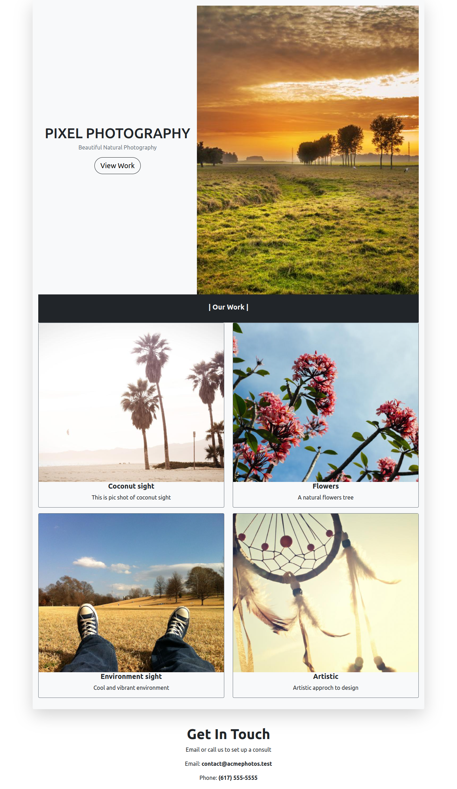

# Create a Responsive Web Page for Pixel Photography 

## Context

Pixel photography is a well known fast growing photography website, covering every aspect of image-making, from DSLRs and photo editing. Now, the company is very keen on making the information available in the best possible way so that the information is **well presented and organized** on all web devices.​ 

As a Frontend Developer, you would have to create a **Responsive** Web Page to showcase all the pictures in a way that will inspire new photographers and help Pixel Photography to reach a wider audience.

## Problem Statement

Develop a responsive web page that displays a variety of pictures and inspires the new photographers. Use the Bootstrap framework to develop the web page.​
The web page created should resemble the images below.

**Desktop View**



**Mobile View**


## Tasks

- The HTML code for the page design should be written in the `index.html` file.​
- Add Bootstrap framework CSS classes inside `index.htm`l file to style and make the web page responsive for desktop and mobile devices.​​
- The web page contains 5 sections:​
    - Section 1: Two column grid as header ​
    - Section 2: Single column grid as separator​
    - Section 3: Two column grid with cards​
    - Section 4: Two column grid with cards​
    - Section 5: Single column grid as footer ​

Note: The responsiveness must be implemented based on Column Drop Layout pattern​.​
- This pattern starts with multi-column layout and ends up with single column, dropping columns along the way as screen sizes get narrower.​​

### Define styles with Bootstrap classes

| Purpose |Bootstrap Classes| Examples
|-------|--------|-----|
|Bootstrap grid system classes for full responsiveness|.container, .container-fluid, .row, .col-*| |
|Buttons for actions in forms and dialogs|.btn, .btn-*, .btn-lg, .btn-sm | |
| Shorthand, responsive margin and padding utility classes|m{side}-{size},p{side}-{size}|.mt-4, .mx-3, .mb-2​,.py-3, .pb-0, .pe-4|
|Text utility classes for line height, alignment and fonts|.text-dark, .text-center, .fw-*, .lh-* ||


#### Image Details
- Dashboard Image: `https://picsum.photos/id/110/500/650`
- Coconut sight: `https://picsum.photos/id/108/700/600`
- Flowers: `https://picsum.photos/id/106/700/600`
- Environment Sight: `https://picsum.photos/id/103/700/600`
- Artistic: `https://picsum.photos/id/104/700/600`

#### Text Used:

```
This is pic shot of coconut sight

A natural flowers tree

Cool and vibrant environment

Artistic approch to design

Get In Touch
Email or call us to set up a consult

Email: contact@acmephotos.test

Phone: (617) 555-5555
```


